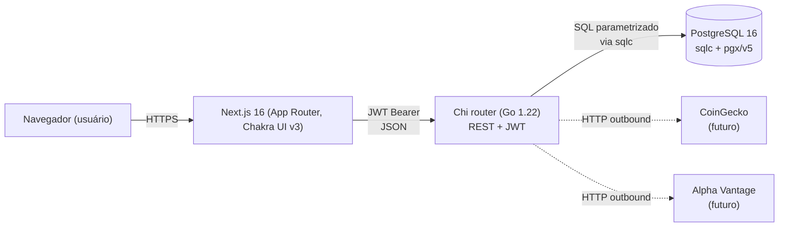

# Arquitetura — Grana Tracker

> Documento de referência para a apresentação final de DIM0547.
> Última atualização: 2026-06-15.

---

## 1. Visão geral

Grana Tracker é uma plataforma web de acompanhamento de investimentos que permite ao usuário cadastrar portfólios (reais ou simulados) e registrar ativos de diferentes classes (ações, ETFs, índices e criptomoedas) em uma única visão consolidada. O backend é escrito em **Go 1.22** sobre o roteador **Chi**, com acesso a banco gerado por **sqlc** (drive `pgx/v5`) e persistência em **PostgreSQL 16**. O frontend usa **Next.js 16** (App Router) com **Chakra UI v3** para a camada visual, e a autenticação é feita por **JWT** com par access/refresh e **rotação de refresh token** com detecção de reuso.

---

## 2. Diagrama do sistema



---

## 3. Ciclo de vida de uma requisição

Toda chamada HTTP entra pelo `server.NewRouter` (`backend/internal/server/router.go`) e passa pela seguinte pilha, do mais externo para o mais interno:

1. **CORS** — `go-chi/cors` configurado com `AllowedOrigins` lido de `FRONTEND_URL` (allowlist explícita por ambiente, **sem wildcard `*`**); `AllowCredentials: true` exige origem nominal.
2. **SecurityHeaders middleware** — injeta cabeçalhos de resposta defensivos em todas as rotas:
   - `X-Content-Type-Options: nosniff`
   - `X-Frame-Options: DENY`
   - `Referrer-Policy: strict-origin-when-cross-origin`
   - `Strict-Transport-Security` (HSTS) em produção
   - `Content-Security-Policy` restritiva
3. **chi Logger + Recoverer** — logging estruturado por requisição e recuperação de `panic` para evitar derrubar o processo.
4. **Rate limit (`/api/auth`)** — `httprate.LimitByIP(10, time.Minute)` aplicado **somente** ao grupo de rotas de autenticação (`/register`, `/login`, `/refresh`) para frear brute-force e enumeração.
5. **AuthMiddleware** (aplicado a `/api/user`, `/api/portfolios`, `/api/investments`):
   - Extrai o cabeçalho `Authorization: Bearer <token>`.
   - Chama `ValidateToken` com **signing method pinned** em HMAC (`HS256`) — bloqueia ataque de *alg confusion* (`alg: none`, troca para RSA).
   - Em sucesso, injeta `user_id` (UUID) no `context.Context` da request.
   - Em falha, responde **401 genérico** sem expor a causa.
6. **Handler**:
   - `decodeJSON` com `DisallowUnknownFields()` — qualquer campo extra no body retorna 400 (defesa contra *mass-assignment*).
   - Validação de payload (campos obrigatórios, tipos, enums).
   - Chamada à camada `sqlc.Queries` (SQL pré-gerado, parametrizado).
   - **Checagem de ownership / IDOR**: toda rota `/{id}` confirma que o recurso pertence ao `user_id` do contexto antes de retornar.
   - Resposta via `writeJSON` / `writeError` em envelope padronizado: `{ "data": ... }` em sucesso, `{ "error": "...", "code": "..." }` em erro.

---

## 4. Decisões técnicas (ADRs resumidos)

### ADR-001 — sqlc + pgx/v5 (vs raw queries ou ORM)
- **Decisão:** geração de código tipado a partir de SQL versionado em `backend/db/queries/*.sql`.
- **Contexto:** queries cruas exigem boilerplate de scan/erro; ORMs (gorm, ent) escondem o SQL real e abrem espaço para N+1 silencioso.
- **Consequências:** SQL revisável em PR, structs e métodos gerados em tempo de build, zero reflexão em runtime, conexões com pool nativo via `pgxpool`.

### ADR-002 — Chi (vs gin / echo)
- **Decisão:** `go-chi/chi/v5` como router.
- **Contexto:** precisamos de middleware composto, sub-routers (`/api/auth`, `/api/portfolios`) e compatibilidade total com `net/http`.
- **Consequências:** stdlib-friendly (sem framework lock-in), middleware reaproveitável, ecossistema (`cors`, `httprate`) plug-and-play.

### ADR-003 — JWT pair com rotação de refresh
- **Decisão:** `access_token` HS256 com TTL **15min** + `refresh_token` opaco com TTL **7 dias** persistido em tabela `refresh_tokens` (hash **SHA-256**, `revoked_at`, `replaced_by`).
- **Contexto:** access curto reduz janela de roubo; refresh persistido permite revogação imediata e auditoria.
- **Consequências:** em cada `/refresh`, o token antigo é marcado `revoked_at = NOW()` e aponta para o novo via `replaced_by`. Se um refresh já consumido for reapresentado, dispara **theft response**: invalida toda a família de tokens daquele usuário.

### ADR-004 — bcrypt com DefaultCost
- **Decisão:** `golang.org/x/crypto/bcrypt` com `DefaultCost` (10) para `password_hash`.
- **Contexto:** algoritmos como SHA-256 puro são rápidos demais e expõem o banco a ataques offline.
- **Consequências:** custo computacional configurável; nunca armazenamos a senha em claro nem hash reversível.

### ADR-005 — Migration runner próprio com `schema_migrations`
- **Decisão:** `db.RunMigrations` (`backend/internal/db`) varre `db/schema/*.up.sql` em ordem e marca aplicadas na tabela `schema_migrations`.
- **Contexto:** evita dependência de `golang-migrate` (binário extra, CLI separada) e mantém o boot autossuficiente.
- **Consequências:** `main.go` executa migrações antes de servir tráfego; menos componentes em produção; controle total sobre transação por migração.

### ADR-006 — Monorepo (`backend/` + `frontend/`)
- **Decisão:** um único repositório com pastas separadas por stack.
- **Contexto:** times pequenos, deploy coordenado, contratos (DTOs) alinhados.
- **Consequências:** um PR pode tocar API e UI simultaneamente; pipelines de CI separados por path filter; menor sobrecarga de versionamento de schemas.

### ADR-007 — `DisallowUnknownFields` em todos os decoders
- **Decisão:** todo `json.Decoder` chamado nos handlers ativa `DisallowUnknownFields()`.
- **Contexto:** sem essa flag, o Go ignora silenciosamente campos extras, abrindo espaço para *mass-assignment* (ex.: enviar `"is_admin": true`).
- **Consequências:** qualquer campo desconhecido retorna **400 Bad Request**; contratos de API ficam estritos e auditáveis.

---

## 5. Estrutura do projeto

```
Grana-Tracker/
├── backend/
│   ├── cmd/
│   │   └── server/
│   │       └── main.go              # entrypoint: env, pool pgx, migrações, http.Server
│   ├── internal/
│   │   ├── handlers/                # auth, user, portfolio, investment, health
│   │   ├── middleware/              # AuthMiddleware, SecurityHeaders, rate limit
│   │   ├── services/                # regras de negócio (tokens, hashing, ownership)
│   │   ├── server/
│   │   │   └── router.go            # NewRouter — única fonte de verdade de rotas
│   │   └── db/                      # migration runner, helpers de pool
│   ├── db/
│   │   ├── schema/                  # 001_init.up.sql, *.down.sql
│   │   ├── queries/                 # *.sql consumidos pelo sqlc
│   │   └── sqlc/                    # código Go gerado (NÃO editar à mão)
│   └── go.mod
├── frontend/                        # Next.js 16 (App Router) + Chakra UI v3
├── docs/
│   ├── ARCHITECTURE.md              # este arquivo
│   ├── AVALIACAO.md
│   └── SPRINT2_VIDEO_SCRIPT.md
└── .github/
    └── workflows/                   # CI: lint + test backend e frontend
```

---

## 6. Camadas e responsabilidades

| Pacote / pasta                         | Responsabilidade                                                                                          |
| -------------------------------------- | --------------------------------------------------------------------------------------------------------- |
| `backend/cmd/server`                   | Bootstrap: carregar env, abrir `pgxpool`, rodar migrações, montar `http.Server` com shutdown gracioso.    |
| `backend/internal/server`              | Composição do roteador Chi: middlewares globais, sub-rotas, injeção de dependências nos handlers.         |
| `backend/internal/handlers`            | Camada HTTP: decode/validate, chama serviços/queries, monta envelope `{data}` ou `{error, code}`.          |
| `backend/internal/middleware`          | `AuthMiddleware` (JWT), `SecurityHeaders`, rate limit por IP, helpers de contexto.                        |
| `backend/internal/services`            | Regras de negócio puras: emissão de JWT, hash bcrypt, rotação/revogação de refresh, checks de ownership.  |
| `backend/internal/db`                  | Runner de migrações idempotente sobre tabela `schema_migrations`.                                         |
| `backend/db/schema`                    | DDL versionado (`.up.sql` / `.down.sql`).                                                                 |
| `backend/db/queries`                   | SQL fonte para o sqlc — único lugar onde escrevemos SQL à mão.                                            |
| `backend/db/sqlc`                      | Código Go gerado pelo sqlc (queries tipadas, structs de linha).                                           |
| `frontend/`                            | App Next.js 16 (App Router), client de API, telas de auth, portfólios e investimentos com Chakra UI v3.   |
| `.github/workflows`                    | CI: lint, build e suíte de testes a cada push/PR.                                                         |

---

## 7. Segurança

Controles aplicados no código atual:

- **bcrypt** (`DefaultCost`) para senhas — nunca armazenamos texto em claro.
- **JWT HS256** com **signing method pinned** em `ValidateToken` — bloqueia ataque de *alg confusion* (`none`, troca para RSA).
- **AuthMiddleware Bearer** — exige `Authorization: Bearer <token>` em todas as rotas privadas, injeta `user_id` no contexto.
- **Refresh token rotation com theft response** — cada `/refresh` consome o token antigo (`revoked_at`, `replaced_by`); reuso de token já consumido revoga a família inteira do usuário.
- **Ownership / IDOR check** em **todas** as rotas `/{id}` (`/portfolios/{id}`, `/investments/{id}`) — confirma que o recurso pertence ao `user_id` do JWT antes de qualquer leitura/escrita.
- **Rate limit por IP** em `/api/auth` (`httprate.LimitByIP`, **10 req/min**) — freia brute-force de login e enumeração de e-mails.
- **Security response headers** — `X-Content-Type-Options`, `X-Frame-Options: DENY`, `Referrer-Policy`, HSTS, CSP em toda resposta.
- **SQL parametrizado via sqlc** — zero concatenação de string com input do usuário; SQL injection eliminado por construção.
- **CORS escopado por ambiente** — `AllowedOrigins` lido de `FRONTEND_URL`, **nunca `*`** quando há credenciais.
- **401 genérico (anti-enumeration)** — `/login` e `/refresh` não distinguem "usuário não existe" de "senha errada".
- **`DisallowUnknownFields`** em todos os decoders JSON — bloqueia *mass-assignment* (ex.: `"is_admin": true` no body).

---

## 8. Testes

A suíte conta com **33+ testes** distribuídos em:

- **Handlers** — testes de tabela cobrindo paths felizes, validação, 401/403/404 e contratos JSON.
- **Services** — testes unitários de emissão/validação de JWT, hashing, rotação de refresh e cenário de *theft response*.
- **Middleware** — `AuthMiddleware` (token ausente, expirado, alg trocado), CORS e rate limit.
- **Integração com Postgres real** — usam `TEST_DATABASE_URL` apontando para um Postgres efêmero (serviço do CI) e exercitam o `NewRouter` montado igual ao de produção.

Tudo é executado no pipeline do GitHub Actions a cada **push** e **pull request** contra `main`, bloqueando merges com regressão.

---

## 9. Próximos passos / fora de escopo

Itens conscientemente deixados para iterações futuras:

- **Cotações em tempo real** — integração com **CoinGecko** (cripto) e **Alpha Vantage** (ações/ETFs) está prevista como **atualização diária em batch** (job agendado populando `price_cache` e `price_history`), não streaming WebSocket.
- **Dashboard com gráficos** — visualização de evolução do patrimônio, alocação por classe e P/L histórico (consumindo `price_history`).
- **Modo simulação completo** — portfólios `type = 'simulated'` já existem no schema, falta a UI dedicada de aportes hipotéticos e comparação com cenário real.
- **Importação por CSV / corretora** — onboarding em massa de posições.
- **Notificações** — alertas de variação por e-mail (via job + provider externo).
- **Multi-moeda na UI** — backend já guarda `preferred_currency`; falta conversão FX consistente nas telas.
- **Observabilidade** — métricas Prometheus e tracing OpenTelemetry; hoje temos apenas log estruturado.
- **Deploy gerenciado** — Dockerfile e workflow de release automatizado para Fly.io / Render.
