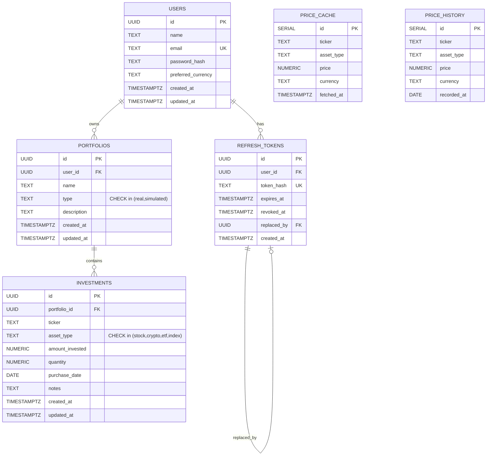

# Modelo de dados

O Grana Tracker organiza seu domínio em cinco entidades principais — `users`, `portfolios`, `investments`, `price_cache` e `price_history` — complementadas pela tabela operacional `refresh_tokens`, responsável pelo controle de sessões JWT. O modelo é dominado por três relacionamentos 1:N: `users → portfolios` (um usuário possui múltiplas carteiras), `portfolios → investments` (uma carteira agrega múltiplos investimentos) e `users → refresh_tokens` (um usuário pode ter múltiplos tokens ativos simultaneamente em dispositivos distintos). A persistência é feita em **PostgreSQL 16** acessado via **pgx/v5** como driver e **sqlc** para geração de código tipado a partir das queries SQL, garantindo integridade referencial em nível de banco e segurança de tipos em nível de aplicação.

# Diagrama ER

# Tabelas

## users

Representa o usuário final autenticado da plataforma; é a raiz da hierarquia de dados de domínio (todo dado pertence direta ou indiretamente a um `user`).

| Coluna | Tipo | Constraint | Descrição |
|---|---|---|---|
| `id` | UUID | PRIMARY KEY, DEFAULT `gen_random_uuid()` | Identificador único do usuário |
| `name` | VARCHAR(255) | NOT NULL | Nome de exibição |
| `email` | VARCHAR(255) | UNIQUE, NOT NULL | E-mail usado como credencial de login |
| `password_hash` | VARCHAR(255) | NOT NULL | Hash bcrypt da senha (nunca armazenado em texto puro) |
| `preferred_currency` | VARCHAR(3) | DEFAULT `'BRL'` | Moeda preferencial para exibição (ISO 4217) |
| `created_at` | TIMESTAMP | DEFAULT `NOW()` | Data de criação do registro |
| `updated_at` | TIMESTAMP | DEFAULT `NOW()` | Data da última atualização |

## portfolios

Carteira de investimentos pertencente a um usuário; pode ser do tipo `real` (patrimônio efetivo) ou `simulated` (cenários de teste sem impacto patrimonial).

| Coluna | Tipo | Constraint | Descrição |
|---|---|---|---|
| `id` | UUID | PRIMARY KEY, DEFAULT `gen_random_uuid()` | Identificador único da carteira |
| `user_id` | UUID | NOT NULL, FK → `users(id)` ON DELETE CASCADE | Dono da carteira |
| `name` | VARCHAR(255) | NOT NULL | Nome amigável da carteira |
| `type` | VARCHAR(20) | NOT NULL, CHECK IN (`'real'`, `'simulated'`) | Tipo da carteira |
| `description` | TEXT | NULL | Descrição livre opcional |
| `created_at` | TIMESTAMP | DEFAULT `NOW()` | Data de criação |
| `updated_at` | TIMESTAMP | DEFAULT `NOW()` | Data da última atualização |

## investments

Posição individual de um ativo dentro de uma carteira; cada compra é registrada como um investimento separado para preservar o custo médio e a data de aquisição.

| Coluna | Tipo | Constraint | Descrição |
|---|---|---|---|
| `id` | UUID | PRIMARY KEY, DEFAULT `gen_random_uuid()` | Identificador único do investimento |
| `portfolio_id` | UUID | NOT NULL, FK → `portfolios(id)` ON DELETE CASCADE | Carteira à qual pertence |
| `ticker` | VARCHAR(20) | NOT NULL | Código do ativo (ex.: `PETR4`, `BTC`, `IVVB11`) |
| `asset_type` | VARCHAR(20) | NOT NULL, CHECK IN (`'stock'`, `'crypto'`, `'etf'`, `'index'`) | Classe do ativo |
| `amount_invested` | DECIMAL(18,2) | NOT NULL | Valor em moeda investido na operação |
| `quantity` | DECIMAL(18,8) | NULL | Quantidade adquirida (8 casas para cripto) |
| `purchase_date` | DATE | NOT NULL | Data da compra |
| `notes` | TEXT | NULL | Observações livres |
| `created_at` | TIMESTAMP | DEFAULT `NOW()` | Data de criação |
| `updated_at` | TIMESTAMP | DEFAULT `NOW()` | Data da última atualização |

## refresh_tokens

Persistência dos refresh tokens emitidos pela autenticação JWT; suporta rotação encadeada (`replaced_by`) e revogação (`revoked_at`) para mitigar reuso de tokens.

| Coluna | Tipo | Constraint | Descrição |
|---|---|---|---|
| `id` | UUID | PRIMARY KEY | Identificador único do token |
| `user_id` | UUID | NOT NULL, FK → `users(id)` ON DELETE CASCADE | Usuário dono do token |
| `token_hash` | TEXT | UNIQUE, NOT NULL | Hash SHA-256 hexadecimal do token bruto (o valor cru nunca é persistido) |
| `expires_at` | TIMESTAMPTZ | NOT NULL | Momento de expiração natural do token |
| `revoked_at` | TIMESTAMPTZ | NULL | Momento de revogação explícita (logout ou rotação) |
| `replaced_by` | UUID | NULL, FK → `refresh_tokens(id)` ON DELETE SET NULL | Token que sucedeu este na rotação |
| `created_at` | TIMESTAMPTZ | NOT NULL | Data de emissão |

## price_cache

Cache de cotações correntes por par `(ticker, asset_type)` consumido a partir de provedores externos; usado para reduzir latência e custo de chamadas de API.

| Coluna | Tipo | Constraint | Descrição |
|---|---|---|---|
| `id` | SERIAL | PRIMARY KEY | Identificador sequencial |
| `ticker` | VARCHAR(20) | NOT NULL | Código do ativo |
| `asset_type` | VARCHAR(20) | NOT NULL | Classe do ativo |
| `price` | DECIMAL(18,8) | NOT NULL | Última cotação conhecida |
| `currency` | VARCHAR(3) | DEFAULT `'USD'` | Moeda da cotação |
| `fetched_at` | TIMESTAMP | DEFAULT `NOW()` | Momento da coleta |
| — | — | UNIQUE (`ticker`, `asset_type`) | Garante uma única linha por ativo |

## price_history

Série histórica diária de preços por par `(ticker, asset_type, recorded_at)`; alimenta gráficos de evolução patrimonial.

| Coluna | Tipo | Constraint | Descrição |
|---|---|---|---|
| `id` | SERIAL | PRIMARY KEY | Identificador sequencial |
| `ticker` | VARCHAR(20) | NOT NULL | Código do ativo |
| `asset_type` | VARCHAR(20) | NOT NULL | Classe do ativo |
| `price` | DECIMAL(18,8) | NOT NULL | Preço de fechamento do dia |
| `currency` | VARCHAR(3) | DEFAULT `'USD'` | Moeda da cotação |
| `recorded_at` | DATE | NOT NULL | Dia de referência |
| — | — | UNIQUE (`ticker`, `asset_type`, `recorded_at`) | Impede duplicidade diária |

# Relacionamentos

- `portfolios.user_id` → `users.id` **ON DELETE CASCADE** — remover um usuário apaga todas as suas carteiras.
- `investments.portfolio_id` → `portfolios.id` **ON DELETE CASCADE** — remover uma carteira apaga todos os investimentos contidos.
- `refresh_tokens.user_id` → `users.id` **ON DELETE CASCADE** — remover um usuário invalida e apaga todos os seus tokens.
- `refresh_tokens.replaced_by` → `refresh_tokens.id` **ON DELETE SET NULL** — se o token sucessor for apagado, o predecessor mantém-se íntegro com o ponteiro nulo (preserva auditoria sem ciclos de exclusão).

# Índices

- `users(email)` **UNIQUE** — login por e-mail e prevenção de duplicidade.
- `refresh_tokens(token_hash)` **UNIQUE** — lookup O(1) na validação do token apresentado pelo cliente.
- `refresh_tokens(user_id)` — listagem e revogação em massa por usuário.
- `refresh_tokens(expires_at)` — varredura eficiente de tokens expirados (job de limpeza).
- `price_cache(ticker, asset_type)` **UNIQUE** — upsert atômico da cotação corrente.
- `price_history(ticker, asset_type, recorded_at)` **UNIQUE** — impede inserir o mesmo dia duas vezes para o mesmo ativo.

# CHECK constraints

- `portfolios.type` **CHECK (`type IN ('real', 'simulated')`)** — restringe a carteira aos dois modos de uso suportados pela aplicação (patrimônio real vs. cenário simulado).
- `investments.asset_type` **CHECK (`asset_type IN ('stock', 'crypto', 'etf', 'index')`)** — limita a classe do ativo aos tipos para os quais existe lógica de cotação e exibição implementada.
